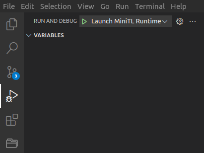
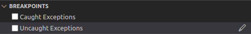
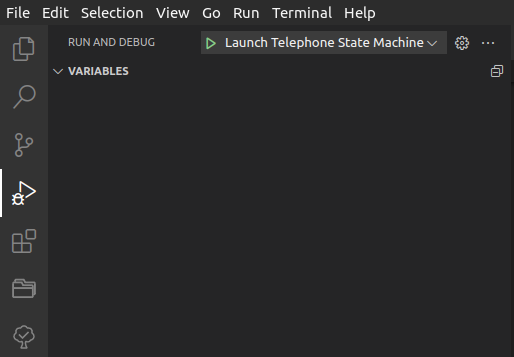
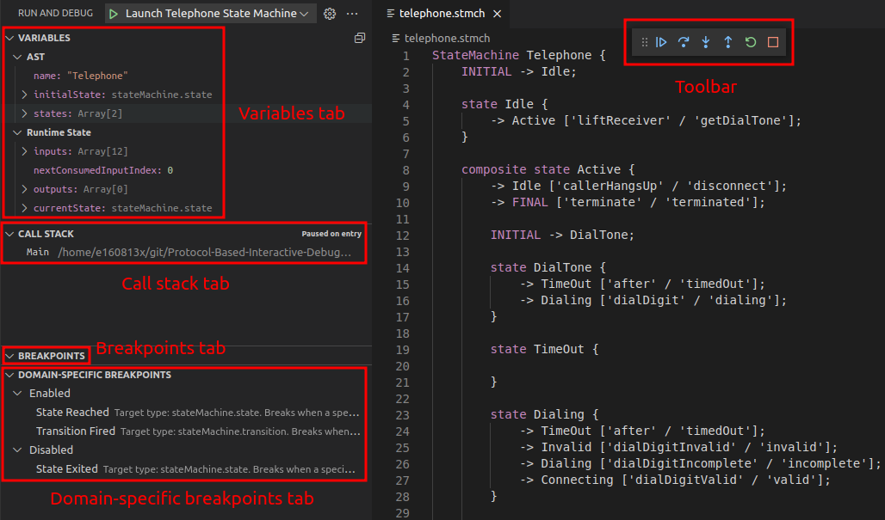
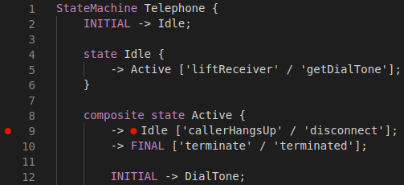
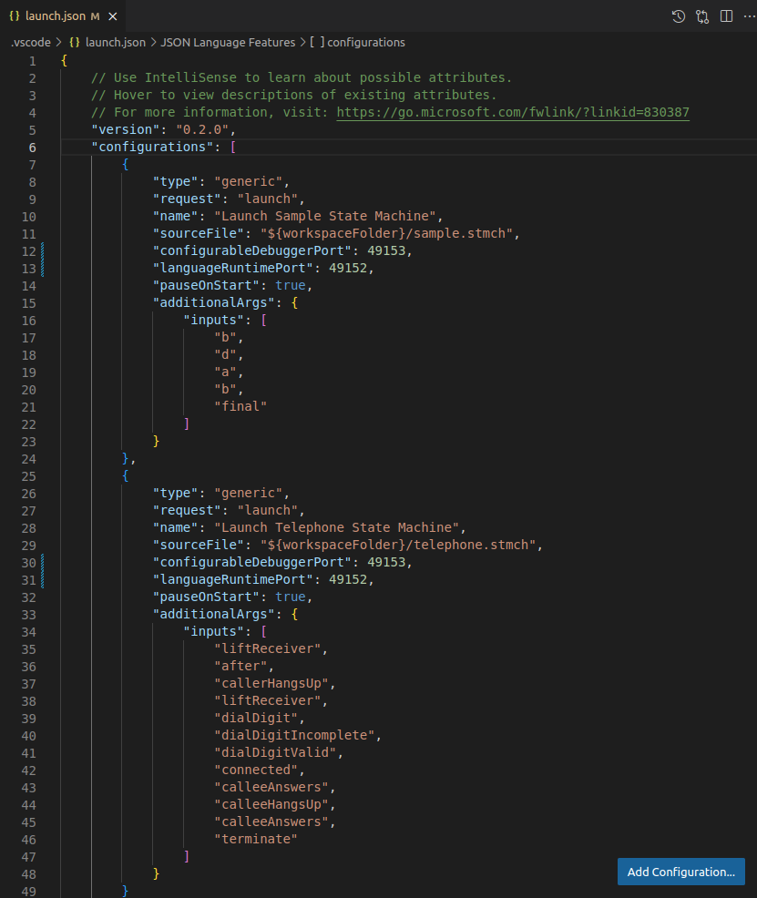
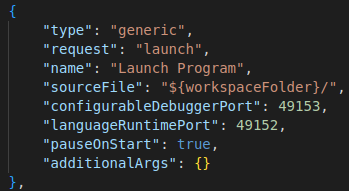
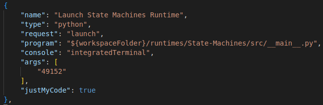
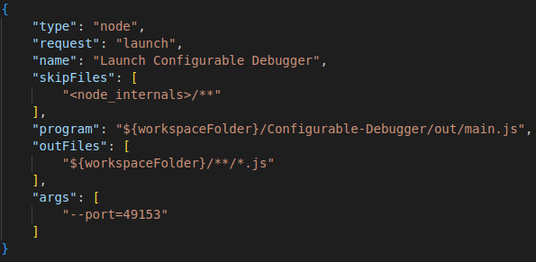

# Protocol-Based-Interactive-Debugging-for-DSLs-Prototype
Prototype for the research paper 'Protocol-Based Interactive Debugging for Domain-Specific Languages' by Enet et al. submitted at ECMFA 2023.

> **Warning**
> 
> This repository uses Git submodules.
> To clone the content of the modules, please use the following command:
> 
> `git clone --recurse-submodules https://github.com/NaoMod/Protocol-Based-Interactive-Debugging-for-DSLs-Prototype`
>
> A module refers to a specific commit in a repository. If you want to visit the repository of a module, please make sure to access it by clicking on their folders on GitHub; this will lead you to the correct commit in the target repository.

## Structure Overview

- Configurable-Debugger: Typescript implementation of a configurable debugger.
- Configurable-Debugger-Protocols-Specification: JSON schema specification for the JSON-RPC implementation of the Language Runtime Protocol (LRP) and configurable Debug Adapter Protocol (cDAP).
- Configurable-Debugger-VSCode-Extension: VSCode extension for the use of a configurable debugger.
- runtimes: implementations of language runtimes for the considered DSLs.
  - State-Machines: Python implementation of a State Machines DSL. Uses ANTLR for parsing.
  - MiniTL: Java implementation of a minimal transformation language. Uses XText for parsing and Kermeta 3 for the operational semantics.

## Launching the VSCode Extension

First, make sure you have cloned this repository with the command specified at the beginning of this guide. The modules, such as the folder Configurable-Debugger, **should NOT be empty**.

Start VSCode, and open the folder of this repository (*File > Open Folder...*). Then, open the *Run and Debug* view on the left sidebar (or with the shortcut *Ctrl + Shift + D*).

A dropdown menu can be found at the top of the view. Running a configuration is done by selecting a configuration from this menu and clicking on the green arrow next to it.

First, start a language runtime of your choice by running either the *Launch State Machines Runtime* or *Launch MiniTL Runtime* configuration. Please make sure you have the necessary dependencies installed; they are listed in each respective repository.

Then, run the *Launch Configurable Debugger* configuration.

Finally, run the *Launch Configurable Debug Extension* configuration. This will start a new instance of VSCode in which our configurable debugger can be used.

> **Warning**
> 
> For unknown reasons, an exception is launched when our extension is started.
> Before running the *Launch Configurable Debug Extension* configuration, open the 'Breakpoints' tab present at the bottom of the *Run and Debug* view. If this tab is not present, click on the dots symbol in the top right corner of the *Run and Debug* view and select it. Simply make sure the box 'Uncaught Exceptions' is unchecked.
> 

## Debugging a Sample Program

### Starting a Debug Session

Sample programs for both DSLs are provided in the folder *Configurable-Debugger-VSCode-Extension/sampleWorkspace*. To start debugging one of them, open the folder **in the new instance of VSCode** (*File > Open Folder...*).

Open the *Run and Debug* view on the left sidebar (or with the shortcut *Ctrl + Shift + D*).

As in the previous section, a dropdown menu allows you to select which program you wish to debug. Click on the green arrow next to it to start debugging. The configurations are set to pause the program after its initialization, before executing any step. As such, even if no breakpoint is set, you should be presented with a paused debug session. The available features and how to use them are further explored in the next section.

### Using Debugging Features

When the debug session is paused, the 'Variables' tab in the *Run and Debug* view is populated. In the case of our extension, both the AST and Runtime State of the running program are available. You can browse the different elements by clicking on them to expand their content.

The 'Call Stack' tab shows the running threads as well as the reason for the pause. In our extension, a program is always running in a single thread. When starting a debug session for one of the sample programs, notice that the pause reason is "Paused on entry". This reason will be different when a pause occurs because a breakpoint is activated or a pause is manually triggered by the user.

The 'Breakpoints' tab shows the source breakpoints currently assigned to the source file. In our extension, these source breakpoints are translated to domain-specific breakpoints depending on the syntax element they are attached to. Only inline breakpoints (i.e., breakpoints that specify a line AND a column) are usable in our extension. To put a new inline breakpoint, right-click at the desired location in the source file and select *Add inline breakpoint*. A new item should appear in the breakpoint view.

Finally, the 'Domain-Specific Breakpoints' tab shows the different semantics that are available for breakpoints. They are classified in two categories: the ones that are currently enabled or not. To enable a breakpoint type that is currently disabled, click on the "+" symbol that appears when hovering over the item. More details about the breakpoint types available for each language runtime is available on their respective repository.

If one of the tabs is not present, click on the dots symbol in the top right corner of the *Run and Debug* view and select the missing tabs.

To put an inline breakpoint in a program using VSCode, two options are possible:

- Put your cursor at the desired location for the inline breakpoint in the program. Then, go to the menu bar at the top of the window and click on *Run > New Breakpoint > Inline Breakpoint*. This can be done even when a debug session is not active for the program.
- Right-click at the desired location for the inline breakpoint in the program. Then, select *Add Inline Breakpoint*. This can ONLY be done when a debug session is active for the program.

During a debug session, a successfully set breakpoint will result in a red dot at the desired location.

During a debug session, a toolbar becomes visible and allows triggering [debug actions](https://code.visualstudio.com/Docs/editor/debugging#_debug-actions).
Here's a list of the effect of each debug action in the context of our extension:

- Continue: Resumes the execution of a program until it finishes, a breakpoint is activated, or a pause is required by the user.
- Pause: Pauses the execution of a running program.
- Step Over: Executes the next step.
- Step Into: Executes the next step.
- Step Out: Executes the next step.
- Restart: Restarts the execution.
- Stops: Terminates the debug session.

## Debugging a Custom Program

To debug custom programs, the same process as in the last section must be followed; the only additional step is to create an additionnal [launch configuration](https://code.visualstudio.com/Docs/editor/debugging#_launch-configurations). For the following tutorial, we will consider that we are in the instance of VSCode started by the *Launch Configurable Debug Extension* configuration (see section *Launching the VSCode Extension*), and that the folder *Configurable-Debugger-VSCode-Extension/sampleWorkspace* is open.

Let's consider we create a new source file *newProgram.stmch* at the root of our folder. To create a new launch configuration for this program, begin by opening the *Run and Debug* view on the left sidebar (or with the shortcut *Ctrl + Shift + D*). Click on the gear symbol to the right of the dropdown menu; this will open a file *launch.json* in the editor. 

Click on the *Add Configuration* button present in the bottom right corner and select the *Generic Debug: Launch* option in the appearing menu. A new launch configuration should appear in the file.

Here's a description of the fields you are able to modify:

- **name**: Name of the launch configuration that will appear in the dropdown menu of the *Run and Debug* view. Here, we could call it "Launch New Program".
- **sourceFile**: The source file to debug. In the case of our example, this would be "${workspaceFolder}/newProgram.stmch".
- **configurableDebuggerPort**: The port at which the configurable debugger is listening. Default is 49153. To specify a custom port for the debugger to listen on, refer to section *Specifying Runtime and Debugger Ports*.
- **languageRuntimePort**: The port at which the language runtime is listening. Default is 49152. To specify a custom port for the language runtime to listen on, refer to section *Specifying Runtime and Debugger Ports*.
- **pauseOnStart**: Whether the debugger should pause after initialization, before executing any step.
- **additionalArgs**: Additional arguments that should be passed to the language runtime along with the source file. The list of these arguments is available in the repository of each language runtime. You can also take inspiration from the existing launch configurations.

If you go back to the *Run and Debug* view, a new item corresponding to your new launch configuration should be available in the dropdown menu.

## Specifying Runtime and Debugger Ports

To specify which port the debugger or a language runtime is listening on, the launch configurations must be modified. Note that we are not here in the new instance of VSCode, but in a regular VSCode instance where the folder of this repository is opened.

Open the *Run and Debug* view on the left sidebar (or with the shortcut *Ctrl + Shift + D*). Click on the gear symbol to the right of the dropdown menu; this will open a file *launch.json* in the editor.

For the language runtimes, the port is specified as the only member of the "args" array.

For the debugger, the port is also specified in the "args" array, preceded by the flag "--port=".

